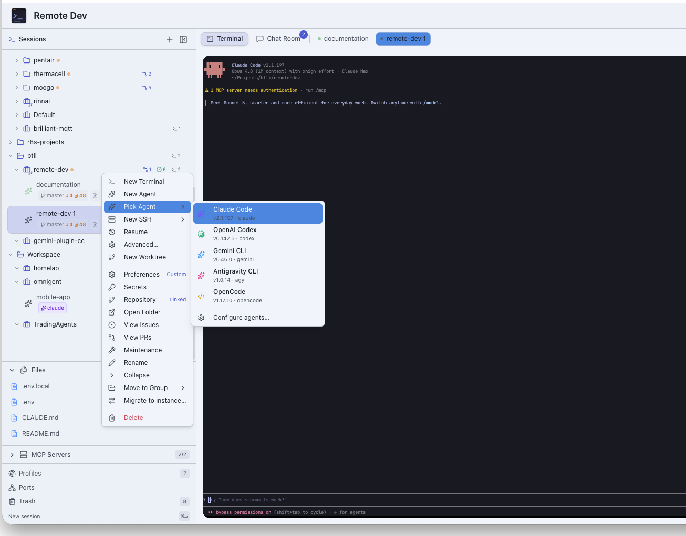

# Remote Dev

A modern, web-based terminal workspace for AI-assisted development. Run persistent terminal sessions in your browser, organize them into projects, and drive multiple AI coding agents — Claude Code, Codex, Gemini, Antigravity, and OpenCode — from one place, on desktop or mobile.




---

## Why Remote Dev?

Coding agents live in the terminal. Remote Dev gives that terminal a home you can reach from any
device: sessions survive disconnects via tmux, agents run in isolated profiles with their own
identities, and a project tree keeps everything organized. Open it in a browser tab, install it as
a PWA, or run the native desktop and mobile apps — your work follows you.

## Features

### Terminals & Sessions
- **Persistent sessions** — Multiple terminals backed by tmux; sessions survive browser refreshes, disconnects, and server restarts.
- **Suspend & resume** — Detach a session and reattach later with full scrollback intact.
- **Recording & playback** — Capture terminal sessions and replay them.
- **Templates** — Save session configurations and spin up new ones in a click.
- **Terminal types** — Pluggable session kinds: `shell`, `agent`, `file` (markdown/code editor), `browser` (headless automation), and `ssh` (tmux-backed remote shells).

### AI Coding Agents
- **Five agents, one workspace** — First-class support for Claude Code, OpenAI Codex, Gemini CLI, Antigravity, and OpenCode.
- **Agent profiles** — Each profile is a fully isolated environment (its own `HOME`, agent config, git identity, and secrets) with per-profile theming.
- **Live status & exit handling** — Agent sessions report running/idle/waiting state and offer a restart screen on exit.
- **Peer messaging** — Agents in the same project discover each other and coordinate over an MCP push channel, with a hook-based fallback.
- **Voice input** — Dictate into agent sessions with a built-in voice mic.

### Organization & Collaboration
- **Project tree** — A two-level group + project hierarchy with preference inheritance (Default → User → Group chain → Project).
- **Tasks** — Per-project task tracking with priorities, labels, subtasks, dependencies, and due dates; group views roll up across descendant projects.
- **Channels** — Slack-style chat channels and DMs with GitHub-flavored markdown, threads, and unread tracking.
- **Notifications** — Debounced, actionable notifications across the app.

### Git & GitHub
- **Multi-account GitHub** — Link multiple GitHub accounts and bind a specific account per project.
- **Repository browsing** — List, clone, and browse repos, branches, folders, and issues.
- **Git worktrees** — Create isolated worktrees for branch-per-task workflows.

### Platform & Operations
- **SSH connections** — Saved, encrypted SSH targets with key generation, password/agent/system auth, and connectivity probes.
- **Secrets** — Per-project secrets provider integration that injects credentials into agent environments.
- **Multi-instance hosting** — Run several isolated instances behind one domain via a runtime URL base path (`RDV_BASE_PATH`).
- **Blue/green deploys** — Zero-fuss production deploys with slot swapping, rollback, and an optional HMAC-signed deploy webhook.
- **Structured logging** — Server-side structured logs with level gating and an in-app Logs viewer.
- **Trash with retention** — Soft-delete with 30-day recovery for sessions, worktrees, and more.

### Clients
- **Web + installable PWA** — Works in any modern browser; installs as a standalone app.
- **Desktop (Electron)** — Native tray, auto-update, and embedded Cloudflare tunnel for remote access (macOS, Linux, Windows).
- **Mobile** — Touch-friendly terminal with a native input bar (autocorrect, voice dictation), plus dedicated mobile app projects.
- **rdv CLI** — A Rust CLI that lets agents drive sessions, tasks, channels, peers, and browsers from the shell.

### Authentication
- **Dual auth model** — Email-only credentials for localhost, Cloudflare Access JWT validation for remote/LAN, and API keys for programmatic access.

## Quick Start

### Prerequisites

- [Bun](https://bun.sh/) (latest)
- [tmux](https://github.com/tmux/tmux) — required for session persistence
- macOS, Linux, or WSL

### Installation

```bash
# Clone the repository
git clone https://github.com/btli/remote-dev.git
cd remote-dev

# Install dependencies
bun install
```

The fastest path is the guided setup script, which writes `.env.local`, initializes the database,
and seeds your user:

```bash
./scripts/init.sh --email you@example.com --port 6001 --terminal-port 6002
```

Or configure manually. Create `.env.local` in the project root:

```bash
# Required — generate with: openssl rand -base64 32
AUTH_SECRET=your-secret-here

# Ports
PORT=6001                       # Next.js web UI
TERMINAL_PORT=6002              # Terminal WebSocket server
NEXT_PUBLIC_TERMINAL_PORT=6002  # Must match TERMINAL_PORT (used by the browser)

# NextAuth v5 base URL (legacy NEXTAUTH_URL is still accepted)
AUTH_URL=http://localhost:6001

# Optional — GitHub integration
GITHUB_CLIENT_ID=your-client-id
GITHUB_CLIENT_SECRET=your-client-secret
```

Then initialize the database and authorize your user:

```bash
bun run db:push
AUTHORIZED_USERS="you@example.com" bun run db:seed
```

### Run

```bash
bun run dev
```

This starts the Next.js web UI and the terminal WebSocket server concurrently. Open
[http://localhost:6001](http://localhost:6001) and sign in with your authorized email.

> Need GitHub repository browsing? Create an OAuth app at
> [GitHub Developer Settings](https://github.com/settings/developers) with callback URL
> `http://localhost:6001/api/auth/github/callback`, then set `GITHUB_CLIENT_ID` /
> `GITHUB_CLIENT_SECRET`. See [docs/SETUP.md](docs/SETUP.md) for the full walkthrough.

## Common Commands

```bash
# Development
bun run dev            # Web UI + terminal server (concurrent)
bun run dev:next       # Next.js only (port $PORT)
bun run dev:terminal   # Terminal server only (port $TERMINAL_PORT)

# Process manager (background)
bun run rdv:dev        # Start both servers in dev mode
bun run rdv:prod       # Start both servers in prod mode
bun run rdv:status     # Show server status
bun run rdv:restart    # Restart servers

# Quality
bun run lint           # ESLint
bun run typecheck      # TypeScript
bun run test:run       # Vitest (single run)

# Database
bun run db:push        # Apply schema to SQLite
bun run db:studio      # Open Drizzle Studio
bun run db:seed        # Seed authorized users

# Production / deploy
bun run build
bun run start          # Next.js
bun run start:terminal # Terminal server
bun run deploy         # Blue/green production deploy

# Desktop app
bun run electron:dev       # Web + terminal + Electron
bun run electron:dist:mac  # Build a macOS distributable
```

## Architecture at a Glance

Remote Dev runs **two servers**:

| Server | Default Port | Responsibility |
|--------|--------------|----------------|
| Next.js | `6001` | Web UI, authentication, API routes, static assets |
| Terminal server | `6002` | WebSocket + node-pty + tmux session management |

```
Browser (xterm.js) <--WebSocket--> Terminal Server (node-pty) <--> tmux <--> Shell
```

A WebSocket disconnect detaches from tmux but keeps the session alive; reconnecting reattaches with
full history. The codebase follows a clean, layered architecture (domain → application →
infrastructure → interface) with Drizzle ORM over libsql (SQLite) for persistence.

For the deep dive, see [docs/ARCHITECTURE.md](docs/ARCHITECTURE.md).

## Documentation

| Document | What's inside |
|----------|----------------|
| [docs/README.md](docs/README.md) | Documentation index — start here |
| [docs/SETUP.md](docs/SETUP.md) | Installation, environment variables, GitHub OAuth, remote access |
| [docs/ARCHITECTURE.md](docs/ARCHITECTURE.md) | System architecture and design |
| [docs/API.md](docs/API.md) | REST API reference (see also [docs/openapi.yaml](docs/openapi.yaml)) |
| [docs/AGENTS.md](docs/AGENTS.md) | Multi-agent CLI support, profiles, and isolation |
| [docs/DEPLOYMENT.md](docs/DEPLOYMENT.md) | Production blue/green deploys and the deploy webhook |
| [docs/MULTI_INSTANCE.md](docs/MULTI_INSTANCE.md) | Hosting multiple isolated instances via `RDV_BASE_PATH` |
| [docs/MOBILE_ARCHITECTURE.md](docs/MOBILE_ARCHITECTURE.md) | Mobile apps and the PWA |
| [docs/ENHANCEMENTS.md](docs/ENHANCEMENTS.md) | Platform capabilities and forward-looking roadmap |

## Contributing

Contributions are welcome.

1. Fork the repository
2. Create a feature branch: `git checkout -b feature/amazing-feature`
3. Run the quality gates: `bun run lint && bun run typecheck && bun run test:run`
4. Commit and push, then open a Pull Request

## License

This project is licensed under the MIT License — see the [LICENSE](LICENSE) file for details.

## Acknowledgments

- [xterm.js](https://xtermjs.org/) — Terminal emulator
- [Next.js](https://nextjs.org/) — React framework
- [shadcn/ui](https://ui.shadcn.com/) — UI components
- [Drizzle ORM](https://orm.drizzle.team/) — Type-safe SQL
- [tmux](https://github.com/tmux/tmux) — Terminal multiplexer
