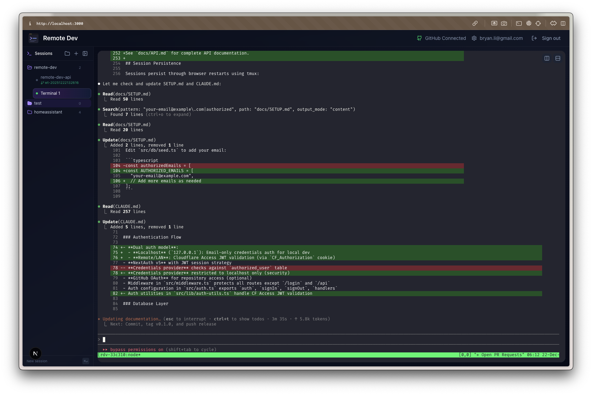

# Building the First "Agent-Native" Terminal: A Weekend Project

It started with a complaint over dinner. I was discussing the new wave of AI coding tools—specifically web-based interfaces like Claude Code—and while the utility was undeniable, the friction was frustrating. 

These tools live in a sandbox. They don't have access to my local aliases, my carefully curated dotfiles, or the specific environment configurations I've spent years tuning. But more importantly, they felt like they were designed for a workflow that didn't quite exist yet.

I realized I wasn't just asking for a better cloud IDE. I was asking for a new kind of interface: one designed not just for me, but for the **AI Agents** I was working with.

So, on December 20, 2025, I began building `remote-dev`.

## The "Simple" Weekend Project

The goal was simple: expose my local terminal to a web interface securely. The initial commit wasn't a hacky script; it was a modern stack from day one:
*   **Next.js 16 (App Router):** For a reactive UI.
*   **xterm.js:** The industry standard for web-based terminal rendering.
*   **NextAuth v5:** Baked-in security.
*   **Drizzle ORM + SQLite:** To manage state without heavy overhead.

By that afternoon, I had a terminal rendering in the browser. But that was just the foundation. The real value came when I started building features *specifically* to supercharge my workflow with AI agents.

## Feature 1: The "One-Click" Worktree

I loved the *concept* of Git Worktrees—isolating branches so you don't break your build state—but the CLI ergonomics are painful. You have to create the directory, `cd` into it, re-run your setup... it disrupts the flow. 

Existing tools like Claude Code support worktrees, but they lock you into *their* environment. I wanted the best of both worlds: the isolation of worktrees, but with *my* local tools (`zsh`, `fzf`, `LSP`).

**The Solution:** I built a service wrapper that automates the entire "context spawn." 
I right-click a folder -> "New Worktree Session". 
In milliseconds, the system:
1.  Creates the physical worktree.
2.  Spins up a new `tmux` session in that specific path.
3.  Injects my environment.
4.  Drops me (and my AI agent) right into the context, ready to code.

I don't "switch branches" anymore. I spin up parallel realities for my code, letting me task an agent on a bug fix in one tab while I architect a feature in another.

## Feature 2: The "Spatial" Terminal

As I moved more work into this tool, I realized why traditional terminals feel limiting: they lack **spatial organization**. When you have 50 active side projects and 3 different agent sessions running, a flat list of tabs is chaos.

I built a virtual file system layer (Folders and Nested Folders) to organize these sessions visually. It’s not just "Tab 1, Tab 2." It’s "Work > Backend > API Service" vs "Side Projects > Blog > UI."

This visual organization is so effective that I've actually stopped using iTerm on my local machine. `remote-dev` has become my primary interface, even when I'm sitting two feet from my server. It manages the mental overhead better than any native terminal emulator I've ever used.

## Feature 3: Persistence (The "Dinner" Test)

The true test of "remote" is continuity. Mobile connections are flaky. If I'm running a long `claude` refactor session, I can't have it die because I switched apps.

I integrated `tmux` deep into the backend. This decoupled the UI from the process. I can start a complex task at home, close my browser, go to dinner, and pull it up on my phone. The session isn't just "there"; it's *alive*. I'm not just monitoring; I'm participating.

The most validating moment came just 24 hours after the first commit. I was at dinner—again—but this time, instead of complaining about tools, I pulled out my phone, logged into `remote-dev`, and used an AI CLI agent to write code *for* `remote-dev`, deploying the changes in real-time.

## Feature 4: The GitHub Bridge

Managing 50 side projects means managing 50 git repositories. I realized I was wasting time just finding clone URLs and typing `git clone`.

I added a **GitHub Integration** layer using OAuth. Now, I have a repository picker that connects directly to my account. I can search for any of my repos (private or public), click "Clone," and the system handles the SSH keys and directory setup.

This integration powers the rest of the workflow. Because the system knows which folder maps to which GitHub repository, it can intelligently suggest creating worktrees for active PRs or recently pushed branches. It turns "git ops" from a typing exercise into a UI interaction, without hiding the underlying terminal when I need it.

## Architecture & Security: "This isn't just a toy"

It's easy to build a web terminal. It's hard to build one that doesn't leave your root shell wide open to the internet. From the start, I treated this as critical infrastructure.

### The Stack
The system is split into two distinct services:
1.  **Next.js Frontend/API:** Handles auth, file system logic, and session state (via Drizzle/SQLite).
2.  **WebSocket Terminal Server:** A dedicated Node.js service that manages `node-pty` processes and `tmux` orchestration.

### Defense in Depth
Exposing a terminal is terrifying, so I implemented layers of defense:
*   **Command Sanitization:** All system calls use `execFile` (passing arguments as arrays) rather than `exec`. This makes shell injection virtually impossible.
*   **Path Traversal Protection:** A rigorous validation layer ensures every file operation stays strictly within allowed directories (e.g., `$HOME`).
*   **Cloudflare Access & JWT:** I didn't just rely on a login form. The entire application sits behind a Cloudflare Tunnel. Access is gated at the edge. The application then verifies the signed **JWT (JSON Web Token)** passed by Cloudflare in the headers. Even if someone bypassed the tunnel, they'd need a cryptographically valid token to even open a WebSocket connection.

This isn't a "weekend hack" in terms of quality—it's a production-grade secure gateway to my machine.

## The Result

What exists now is a fully PWA-capable, secure, and persistent remote development environment.

## Standing on the Shoulders of Giants

It's important to be clear: I didn't invent terminal emulation or persistent sessions. This project wouldn't exist without incredible open-source technology like **xterm.js**, which does all the heavy lifting of rendering a VT100 interface in the browser, or **node-pty**, **tmux**, and **Next.js**.

The AI agents didn't "invent" these pieces either. Their power was in acting as the ultimate integrator—knowing exactly how to glue `xterm.js` to `node-pty` over a WebSocket, or how to wrap `git worktree` in a TypeScript service—allowing me to piece together established, battle-tested technologies into a cohesive whole in record time.

## The Bespoke Advantage

Could I have found a SaaS that does this? Maybe. But it wouldn't have been *this*.

It wouldn't have my specific font rendering. It wouldn't have my exact folder logic. And it certainly wouldn't have been designed with this specific "Agent-Native" workflow in mind, because that workflow is barely a year old.

With modern AI coding tools, the cost of building bespoke software has collapsed. I didn't need a team of engineers to build a persistent, secure, multi-session terminal manager. I just needed a weekend, a clear vision of my own friction points, and the agents to help me build it.

And now, my local setup isn't just available everywhere—it's better everywhere.